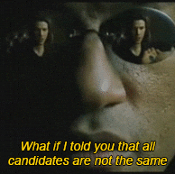

  

  

<h1 align="center">Hi , SAMI HERE!! </h1>

  

<h4>
  Hellow, my name is Mohammedsami, a computer engineering student with a strong interest in artificial intelligence, full-stack development, and building impactful technology products. I enjoy developing innovative solutions such as AI-powered applications, SaaS platforms, and real-     world problem-solving tools.  Currently, focused on learning and exploring machine learning applications, and building projects that combine AI with practical use cases, including deepfake detection systems, satellite data intelligence tools and more. 
</h4>

##
##  Connect With Me:

  

   
   
     

##
##  Tech Stack:

  

 

  <h3></h3>
  <h3>Machine Learning / AI</h3>
    
  <h3>Runtime/Environment</h3>
  
  <h3>Tools & Platforms</h3>
  
  <h3>Frontend</h3>
  
  <h3>Backend</h3>
  
  <h3>Databases</h3>
  
  <h3>Devops and Cloud</h3>
  
  <h3>Languages</h3>
  

##
##  Contributions:

<picture>
  <source media="(prefers-color-scheme: dark)" srcset="https://github.com/Mohammedsami001/Mohammedsami001/blob/output/github-contribution-grid-snake-dark.svg" />
  <source media="(prefers-color-scheme: light)" srcset="https://github.com/Mohammedsami001/Mohammedsami001/blob/output/github-contribution-grid-snake.svg" />
  
</picture>

  

#

  

#

 
    <h2>Humble enough to know that I can be replaced, wise enough to know that there's nobody else like me.</h2>

